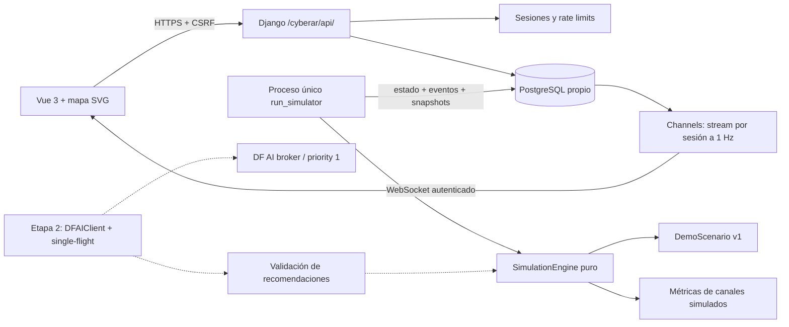

# CYBER.AR 2026

Simulador de comunicaciones resilientes UAV para el Hackathon CYBER.AR. **100% software:** no controla drones, no transmite RF ni implementa protocolos de interferencia. Teatro vectorial ficticio inspirado en el Atlántico Sur.

> El drone no necesita que un único enlace sea perfecto. Necesita un sistema de comunicaciones capaz de adaptarse a la degradación.

## Entrega: iteración 1

Funciona bajo **`/cyberar/`**: login, sesión del servidor, misión OPERACIÓN ATLÁNTICO, mapa SVG propio, UAV con posición calculada por el backend, ruta con ocho puntos, telemetría, cuatro canales simulados, degradación programada o manual, eventos, WebSocket, pausa, reset y velocidades 1×/2×/4×.

**Todavía no implementado:** CommunicationOrchestrator, recomendaciones DF AI, cambio autónomo de canal, imágenes, transmisión progresiva, store-and-forward y recuperación de buffer. El panel DF AI lo informa expresamente y el sistema no envía jobs. Esta etapa demuestra el recorrido y la degradación; la adaptación autónoma se agrega en la siguiente.

## Arquitectura



El servicio ASGI se despliega separado del Django WSGI principal. Nginx conserva el prefijo `/cyberar/`; API, cookies, WebSocket y assets lo utilizan. No necesita DRF, Leaflet, Celery ni servicios externos. Redis existe en el VPS pero esta etapa no lo necesita: cada conexión Channels lee el último estado persistido una vez por segundo y lo transmite al cliente; no hay polling HTTP del frontend. Esto es apropiado para pocas conexiones de demostración. Para escalar, reemplazar ese lector por grupos Channels con Redis.

Un proceso independiente es dueño del reloj. Dos workers web o dos pestañas no aceleran la misión. Un advisory lock de PostgreSQL, mantenido en una conexión dedicada, impide relojes simultáneos incluso en hosts diferentes; `select_for_update` serializa ticks y controles. Si se pierde la conexión de liderazgo, el proceso se detiene. En SQLite de desarrollo se utiliza `flock` en el mismo host. No se hace catch-up de tiempo durante una caída del proceso.

Cada sesión tiene una misión propia. El logout la pausa; la expiración la pausa en el siguiente tick y revoca su socket. Un refresh recupera el último estado. Reset restablece el estado de dominio, velocidad, modo, eventos y snapshots iniciales; conserva el identificador de misión e incrementa `revision` para descartar mensajes viejos.

## Stack y compatibilidad

- Python 3.12+; probado en desarrollo con 3.12 y VPS con 3.14.
- Django **5.2.16**, igual que el servicio principal inspeccionado.
- Vue **3.5**, Vite **6**, JavaScript.
- Django Channels **4.3.2**, Uvicorn.
- PostgreSQL **17.10** del VPS, con base y rol exclusivos `cyberar`.
- SQLite disponible solo para desarrollo y pruebas rápidas.

Las dependencias frontend se fijan mediante `package-lock.json`. `backend/requirements.lock.txt` fija las versiones resueltas del backend; `requirements.txt` explica los rangos compatibles de dependencias directas.

## Instalación y desarrollo

Desde la raíz:

```bash
python3 -m venv .venv
.venv/bin/pip install -r backend/requirements.lock.txt
npm ci --prefix frontend
cp .env.example .env
npm run build --prefix frontend
cd backend
set -a
. ../.env
set +a
../.venv/bin/python manage.py migrate
../.venv/bin/uvicorn config.asgi:application --host 127.0.0.1 --port 8063
```

En otra terminal, cargar las mismas variables y ejecutar desde `backend/`:

```bash
../.venv/bin/python manage.py run_simulator
```

Abrir `http://127.0.0.1:8063/cyberar/`. El ejemplo local permite `admin` / `admin`; producción rechaza contraseñas inferiores a 16 caracteres. `.env` no se carga automáticamente con `manage.py`: exportarlo como arriba. Uvicorn también admite `--env-file ../.env`. Ejecutar siempre desde `backend/` para que la ruta SQLite relativa sea consistente.

Para HMR, `npm run dev --prefix frontend` desde la raíz y abrir `http://localhost:5173/cyberar/`; Vite dirige API/WS al puerto 8063. Agregar cualquier otro origen explícitamente a `DJANGO_CSRF_TRUSTED_ORIGINS`.

## Variables

| Variable | Uso |
| --- | --- |
| `DJANGO_SECRET_KEY` | Clave obligatoria, aleatoria en producción |
| `DJANGO_DEBUG` | `false` en VPS; activa cookies Secure cuando está desactivado |
| `DJANGO_ALLOWED_HOSTS` | Hosts separados por comas |
| `DJANGO_CSRF_TRUSTED_ORIGINS` | Orígenes completos HTTPS; también allowlist exacta de WS |
| `DATABASE_URL` | PostgreSQL en producción; SQLite local |
| `CYBERAR_USER`, `CYBERAR_PASSWORD` | Credenciales verificadas solamente por el backend |
| `CYBERAR_SESSION_SECONDS` | Duración de sesión, 7200 por defecto |
| `CYBERAR_DEMO_DURATION` | Segundos de misión, 150 por defecto; mínimo 30 |
| `CYBERAR_RUNNER_LOCK` | Ruta del lock local cuando se usa SQLite; PostgreSQL utiliza advisory lock |
| `CYBERAR_DEMO_MODE` | Reservada; esta aplicación siempre es un simulador |
| `CYBERAR_AI_ENABLED` | Reservada, mantener `false` en esta iteración |
| `CYBERAR_AI_TIMEOUT` | Reservada para timeout del futuro cliente |
| `DF_AI_URL`, `DF_AI_TOKEN` | Reservadas para el broker existente; no se utilizan todavía |
| `DF_AI_PRIORITY` | Reservada; la siguiente implementación debe fijar `1` |

No usar prefijos `VITE_` para secretos. Ninguna credencial se incluye en el bundle.

## Motor y escenario

`SimulationEngine.advance(state, seconds)` no consulta el reloj, base ni red y no muta el argumento original. `initial()` siempre produce el mismo estado. La máquina de estados admite:

`PREPARING → TAKEOFF → TRANSIT → RECON → RETURN → LANDED → MISSION_COMPLETE`

La condición de comunicación se modela aparte de la fase de vuelo. La siguiente etapa añadirá el estado explícito de adaptación sin confundirlo con la fase física.

Ruta: BASE → CP-01 → CP-02 → CP-03 → RECON-01 → RECON-02 → CP-RETURN → BASE.

| Tiempo base | Evento |
| --- | --- |
| T+01 | Despegue |
| T+08 | Tránsito |
| T+15 | CP-01 |
| T+30 | CP-02; interferencia 32% |
| T+50 | CP-03 |
| T+55 | Interferencia 66% |
| T+65 | Reconocimiento |
| T+70 | RECON-01 |
| T+80 | Interferencia 90% |
| T+90 | RECON-02 |
| T+100 | Regreso |
| T+105 | Restauración de enlaces |
| T+115 | CP-RETURN |
| T+145 | Base y aterrizaje |
| T+150 | Misión completa |

La duración configurable escala toda la secuencia. El reloj de demo comprime una misión ficticia: posición, distancia y velocidad mostradas son variables ilustrativas, no una simulación física certificada. La grilla no representa navegación real. La UI señala que coordenadas y escala son ficticias.

**Demo automática** reinicia y ejecuta. **Reiniciar demo** vuelve a T+00 y queda en pausa. **Red team** permite alternar eventos automáticos/manuales, elegir nivel, degradar/interrumpir RF y restaurar. Cambiar el nivel manualmente desactiva los eventos automáticos. La aplicación no cambia de canal automáticamente en esta etapa.

## Persistencia

`Mission`, `MissionState`, `DemoScenario`, `MissionEvent`, `TelemetrySnapshot` y `CommunicationSnapshot`. El estado vivo se actualiza a 1 Hz, sin acumular frames históricos. Snapshots históricos solamente cada 10 segundos de misión y en transiciones; eventos por cambios discretos. Reset elimina el historial de esa ejecución para reproducir el mismo estado. El modelo `AIAnalysis` se agrega junto con los jobs de la etapa 2.

Sesiones antiguas: programar `manage.py clearsessions` si el servicio se mantiene a largo plazo. La retención de misiones se definirá antes de abrir acceso a más usuarios; esta entrega es una demo de acceso restringido.

## Seguridad

- Sesión de Django persistida en servidor; cookies HttpOnly, Secure en producción, SameSite Strict y path `/cyberar/`.
- CSRF en todas las mutaciones, incluyendo login y logout.
- Rate limit en PostgreSQL, compartido por workers: 8 intentos de login/IP/5 minutos; 90 controles/sesión/minuto.
- Login verifica credenciales con comparación de tiempo constante; no hay passwords en JS.
- WebSocket valida origen, sesión y expiración cada segundo. No acepta comandos entrantes.
- API y estado aislados por sesión, sin aceptar un `mission_id` arbitrario del cliente.
- CSP, protección contra framing, errores de autenticación genéricos.
- Nginx limita cuerpos a 16 KB y reemplaza IP de origen; Uvicorn solo escucha en loopback. No exponer directamente ese puerto a Internet.
- Un usuario no autenticado solo recibe la pantalla de acceso y assets genéricos. No recibe estado ni puede generar misiones o jobs.

## Integración DF AI: siguiente iteración

Inspección del proyecto vecino: el broker recibe `POST /api/ai/jobs/`, `Authorization: Bearer …`, `X-AI-Project: cyberar`, `job_type`, `payload`, `idempotency_key` y `priority`. **La configuración del proyecto en `AI_HUB_PROJECTS_JSON` debe permitir prioridad 1**: el broker aplica `max(prioridad_del_proyecto, prioridad_solicitada)`.

El worker vive en otra máquina. CYBER.AR no debe llamar Ollama directamente. La siguiente entrega debe añadir `DFAIClient`, `MockDFAIClient`, `FallbackDecisionEngine`, `CommunicationOrchestrator` y `AIAnalysis` con:

1. Snapshot estructurado y pequeño; salida JSON validada por enums y límites.
2. Una solicitud activa por misión, debounce y thresholds configurables.
3. `pending_analysis` cuando cambian métricas; comparar contra el estado actual antes de reenviar.
4. Idempotencia también ante timeout de envío; no crear otro job si el anterior puede seguir activo en el broker.
5. Callback autenticado, timeout, retry acotado y circuit breaker.
6. Validación dentro del motor antes de aplicar recomendaciones; ignorar resultados de ejecuciones anteriores a un reset.
7. Mock y reglas locales determinísticas; pruebas de single-flight, cola y fallback junto con su implementación.

No se presenta la telemetría de esta etapa como una respuesta del LLM.

## Pruebas

```bash
cd backend
DJANGO_DEBUG=true DJANGO_SECRET_KEY=test-only ../.venv/bin/python manage.py test tests -v 2
DJANGO_DEBUG=true DJANGO_SECRET_KEY=test-only ../.venv/bin/python manage.py check
cd ..
npm run build --prefix frontend
```

Las pruebas cubren determinismo, avance acelerado, secuencia completa, transiciones inválidas, degradación/restauración, control manual, sesión, CSRF, permisos, aislamiento, rate limiting, cookies, pausa/reset, persistencia, WebSocket, revocación y exclusión/liberación del reloj por advisory lock (estas dos últimas requieren PostgreSQL). No esperan los 150 segundos reales.

## Despliegue

Puerto interno reservado: **8063**. Servicios: `cyberar-web`, `cyberar-simulator`. Directorio independiente `/var/www/cyberar`; no queda dentro del árbol que reemplaza el deploy del sitio principal.

1. Construir frontend y subir `backend/`, `frontend/dist/`, `deploy/` a `/var/www/cyberar/`.
2. Solo la primera vez: `python3 /var/www/cyberar/deploy/provision.py` como root. Crea base/rol y `/etc/cyberar.env` modo 0600, con claves aleatorias; nunca imprime secretos. Rechaza reemplazar un archivo existente.
3. Ejecutar `bash /var/www/cyberar/deploy/install.sh`. Instala el entorno propio, migra **solo** CYBER.AR, instala servicios y el snippet. Inserta una única inclusión en el virtual host existente, preservando una copia anterior. Ejecuta `nginx -t` antes de recargar.
4. Verificar `https://davefrassoni.com/cyberar/` y que `/cyberar/api/state/` sin sesión devuelve 401.
5. Obtener las credenciales por SSH desde `/etc/cyberar.env`; no copiarlas al repositorio ni al frontend. Para rotar: editar ese archivo y reiniciar ambos servicios. Para invalidar todas las sesiones, borrarlas con una operación administrativa explícita.

Actualización: subir los mismos directorios y ejecutar `install.sh`; no ejecutar `provision.py` de nuevo. No se instala nada en el entorno Python del sitio principal. La configuración de referencia de ruta también queda en `davefrassoni/deploy/cyberar.nginx.conf`.

Rollback de ruta: quitar `include /etc/nginx/snippets/cyberar.conf;` del virtual host, `nginx -t`, recargar Nginx y detener ambos servicios. La base puede conservarse. No restaurar ciegamente una copia de Nginx si hubo otros cambios después del despliegue.

## Estructura

```text
backend/
  config/                settings, HTTP y ASGI
  authentication/        sesión, CSRF y rate limiting
  api/                   endpoints y consumidor WebSocket
  simulation/            motor puro, escenario y proceso de reloj
  mission/               modelos, migraciones y transacciones
  communications/        canales y métricas simuladas
  events/                eventos de dominio
  tests/                 motor, API y WebSocket
frontend/src/
  map/ telemetry/ communications/ ai/ events/ demo/
  stores/ services/      estado reactivo, reconexión, API y WebSocket
  App.vue style.css      composición y lenguaje visual
  components/            reservado para componentes compartidos
deploy/                  Nginx, systemd y aprovisionamiento
docs/                    decisiones de arquitectura y alcance
```
